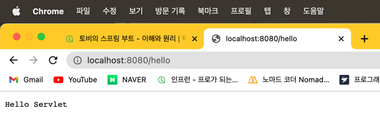

# CH02. 독립 실행형 서블릿 어플리케이션
###### 작성일자: 2023.01.24 (Tue)

------------

## [Containerless 개발 준비]
### "main method 수정"
> Application 클래스 내부에 있는 어노테이션과 import 및 부트 실행 명령 삭제 후, 순수한 자바 어플리케이션 형태

```java
package jinwoospring.helloboot;

public class HellobootApplication {

    public static void main(String[] args) {
        System.out.println("Hello Containerless");
    }
}
```

------------

## [서블릿 컨테이너 띄우기]
### "TomcatSeravletWebServerFactory"
```java
TomcatServletWebServerFactory serverFactory = new TomcatServletWebServerFactory();
```
- 톰캣을 정상적으로 띄우고 서블릿을 구동하게 하기 위해 준비해야하는 설정 정보를 모두 알 필요는 없음
- 스프링 부트가 톰캣 서블릿컨테이너를 내장하여 코드로 쉽게 사용할 수 있게 만든 도우미 클래스
- Factory(): 웹서버를 만드는 복잡한 설정 과정을 거치고 생성하는 도우미 역할

### "getWebserver()"
```java
WebServer webServer = serverFactory.getWebServer();
webServer.start(); //Tomcat Start
```
- getWebserver(): 웹 서버 생성 메소드 → return WebServer type
- **톰캣 외의 다른 서블릿 컨테이너 또한 지원**할 수 있어 특정 서블릿 컨테이너에 국한되지 않고 **모두 일관된 방식으로 동작할 수 있도록 추상화** 되어있음

### “main Source”
```java
package jinwoospring.helloboot;

import org.apache.catalina.startup.Tomcat;
import org.springframework.boot.web.embedded.tomcat.TomcatServletWebServerFactory;
import org.springframework.boot.web.server.WebServer;

public class HellobootApplication {

	public static void main(String[] args) {
		TomcatServletWebServerFactory serverFactory = new TomcatServletWebServerFactory();
		WebServer webServer = serverFactory.getWebServer();
		webServer.start(); //Tomcat Start
	}
}
```

### "톰캣 서버 실행 확인"
> helloboot % http -v :8080
```
GET / HTTP/1.1
Accept: */*
Accept-Encoding: gzip, deflate
Connection: keep-alive
Host: localhost:8080
User-Agent: HTTPie/3.2.1


HTTP/1.1 404 
Connection: keep-alive
Content-Language: en
Content-Length: 682
Content-Type: text/html;charset=utf-8
Date: Tue, 24 Jan 2023 13:18:48 GMT
Keep-Alive: timeout=60
```

------------

## [서블릿 등록]
### "ServletContextInitializer"
> 서블릿 컨테이너에 서블릿을 생성하기 위한 작업을 수행하는 객체 생성
```java
package org.springframework.boot.web.servlet;

import javax.servlet.ServletContainerInitializer;
import javax.servlet.ServletContext;
import javax.servlet.ServletException;

import org.springframework.web.SpringServletContainerInitializer;
import org.springframework.web.WebApplicationInitializer;

@FunctionalInterface
public interface ServletContextInitializer {

	void onStartup(ServletContext servletContext) throws ServletException;
}
```
> @FunctionalInterface: 구현해야 할 메소드가 하나인 클래스 어노테이션

### "서블릿 구현"
```java
package jinwoospring.helloboot;

import org.apache.catalina.startup.Tomcat;
import org.springframework.boot.web.embedded.tomcat.TomcatServletWebServerFactory;
import org.springframework.boot.web.server.WebServer;
import org.springframework.boot.web.servlet.ServletContextInitializer;

import javax.servlet.ServletContext;
import javax.servlet.ServletException;
import javax.servlet.http.HttpServlet;
import javax.servlet.http.HttpServletRequest;
import javax.servlet.http.HttpServletResponse;
import java.io.IOException;

public class HellobootApplication {

    public static void main(String[] args) {
        TomcatServletWebServerFactory serverFactory = new TomcatServletWebServerFactory();
        WebServer webServer = serverFactory.getWebServer(new ServletContextInitializer() {
            @Override
            public void onStartup(ServletContext servletContext) throws ServletException {
                servletContext.addServlet("hello", new HttpServlet() { //어댑터 클래스
                    @Override
                    protected void service(HttpServletRequest req, HttpServletResponse resp) throws ServletException, IOException { //서블릿의 실제 기능 구현
                        resp.setStatus(200);
                        resp.setHeader("Content-Type", "text/plain");
                        resp.getWriter().println("Hello Servlet") ;
                    }
                    //서블릿 컨테이너에서 어떤 서블릿을 사용해야할 지 정하는 Mapping을 설정해야 함.
                }).addMapping("/hello");
            }
        });
        webServer.start(); //Tomcat Start
    }

}
```
#### "실행 결과 확인"
